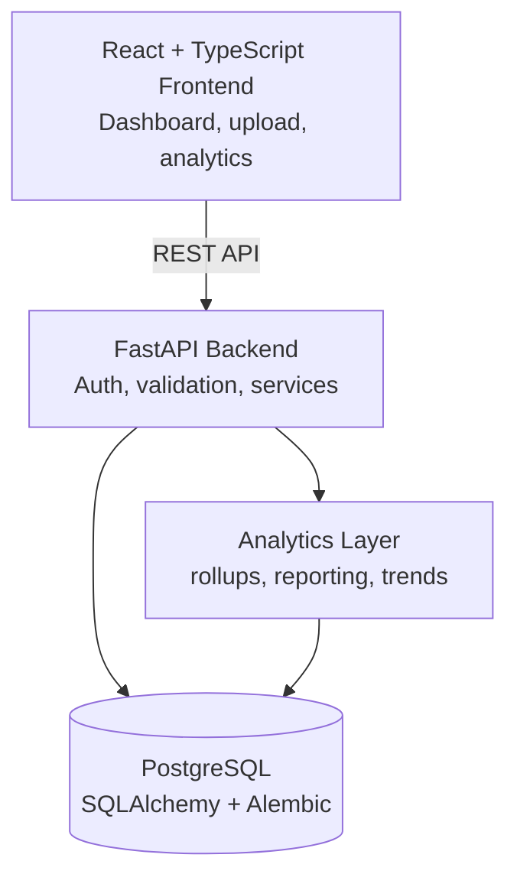
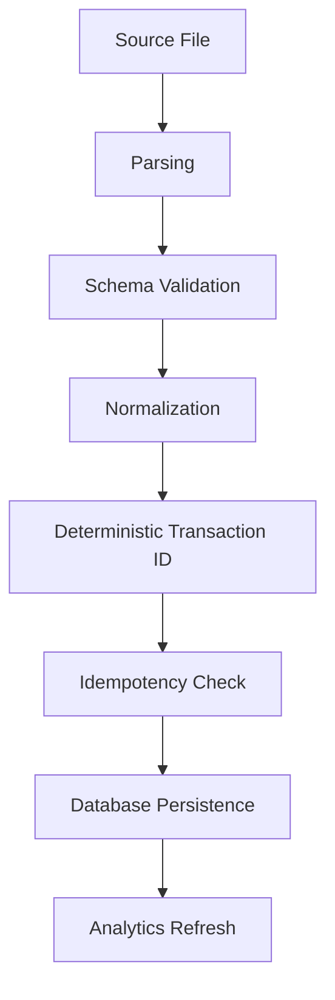

# MoneyBuddy

### A production-style financial data platform for transaction ingestion, reconciliation, and analytics.

MoneyBuddy transforms transaction data from heterogeneous sources such as CSV and Excel statements into a normalized ledger, while preserving data integrity through validation, deterministic transaction identity, and idempotent ingestion.

The platform combines a React/TypeScript frontend with a FastAPI backend, PostgreSQL persistence, and a modular analytics layer.

## Positioning

> Full-stack financial data platform that ingests, reconciles, and analyzes transaction data from heterogeneous sources with idempotent processing and production-grade backend architecture.

This repository is maintained by **Samiksha Mitra**. If the project is presented as collaborative work, document the exact implementation ownership separately from the shared project scope.

## Why MoneyBuddy?

Financial data often arrives in inconsistent formats across banks and financial institutions. Repeated imports can create duplicates, transaction schemas differ between sources, and downstream analytics become unreliable without a normalized source of truth.

MoneyBuddy addresses this through:

- Multi-format transaction ingestion
- Schema validation and normalization
- Deterministic transaction identification
- Idempotent imports
- Reconciliation of repeated and duplicate records
- Server-side pagination and filtering
- Persistent PostgreSQL storage
- Financial analytics and reporting
- Authenticated API access
- Automated testing and CI/CD

## Architecture



## Transaction Ingestion



Transactions receive deterministic identifiers so repeated imports can be processed safely without creating duplicate records, while legitimate repeated transactions with otherwise identical attributes remain distinguishable.

## Idempotent Transaction Ingestion

Repeated statement imports are a common source of duplicate financial records.

MoneyBuddy generates a deterministic SHA-256-based transaction identity from normalized transaction attributes and uses occurrence handling to distinguish legitimate repeated transactions.

```text
same transaction imported twice
             ↓
      no duplicate record

two legitimate identical transactions
             ↓
   both transactions preserved
```

## Engineering Decisions

### FastAPI

Chosen for typed request and response models, clean separation between API and business logic, and a maintainable backend surface.

### PostgreSQL

Used as the persistent source of truth for normalized financial data, supporting relational constraints, indexing, and transactional updates.

### SQLAlchemy

Provides ORM-based data access while keeping persistence logic separate from route handlers.

### Alembic

Used for version-controlled schema migrations.

### TanStack Query

Used for server-state management, request caching, invalidation, and synchronization with backend data.

### OAuth + JWT

Used to protect authenticated financial workspaces and API access.

## Testing & Quality

- Backend tests with `pytest`
- Frontend tests with `Vitest`
- Type checking
- Linting
- Automated CI through GitHub Actions
- Database migration checks
- Regression tests for transaction ingestion and reconciliation

## Production Considerations

The current architecture is designed around clear separation between the frontend, API layer, persistence layer, and analytics services.

For larger workloads, the ingestion pipeline can be extended with:

- Background job processing
- Queue-based ingestion
- Redis caching
- Object storage for source statements
- Horizontal API scaling
- Read replicas for analytics workloads
- Observability and structured logging

## Quick Start

### Prerequisites

- Node.js 22+
- pnpm 11
- Python 3.13+
- `uv`

### Install and run

```bash
git clone https://github.com/Samik123Mit/MoneyBuddy.git
cd MoneyBuddy
pnpm install
pnpm run setup
pnpm run dev
```

### Configuration

Copy the required `MONEYBUDDY_*` entries from [.env.example](.env.example) into `backend/.env`.

```env
MONEYBUDDY_ENVIRONMENT=development
MONEYBUDDY_DATABASE_URL=sqlite:///./moneybuddy.db
MONEYBUDDY_FRONTEND_URL=http://localhost:5173
MONEYBUDDY_JWT_SECRET_KEY=replace-with-at-least-32-random-characters
MONEYBUDDY_ENCRYPTION_KEY=replace-with-a-separate-random-key
```

## CV Positioning

**MoneyBuddy — Full-Stack Financial Data Platform**  
*React, TypeScript, FastAPI, PostgreSQL, SQLAlchemy, Docker, GitHub Actions*

- Built a full-stack financial data platform using React/TypeScript and FastAPI, backed by PostgreSQL, for authenticated transaction ingestion, reconciliation, and financial analytics.
- Engineered an idempotent ingestion pipeline using normalized transaction attributes and deterministic SHA-256 identifiers to prevent duplicate imports while preserving legitimate repeated transactions.
- Implemented production-oriented data access with SQLAlchemy/Alembic, server-side pagination and filtering, automated frontend/backend testing, and CI/CD deployment.

## Documentation

- [Master Doc](docs/MASTER_DOC.md)
- [Architecture](docs/architecture.md)
- [API Reference](docs/API.md)
- [Deployment](docs/DEPLOYMENT.md)
- [Contributing](CONTRIBUTING.md)

## License

MIT. See [LICENSE](LICENSE).
