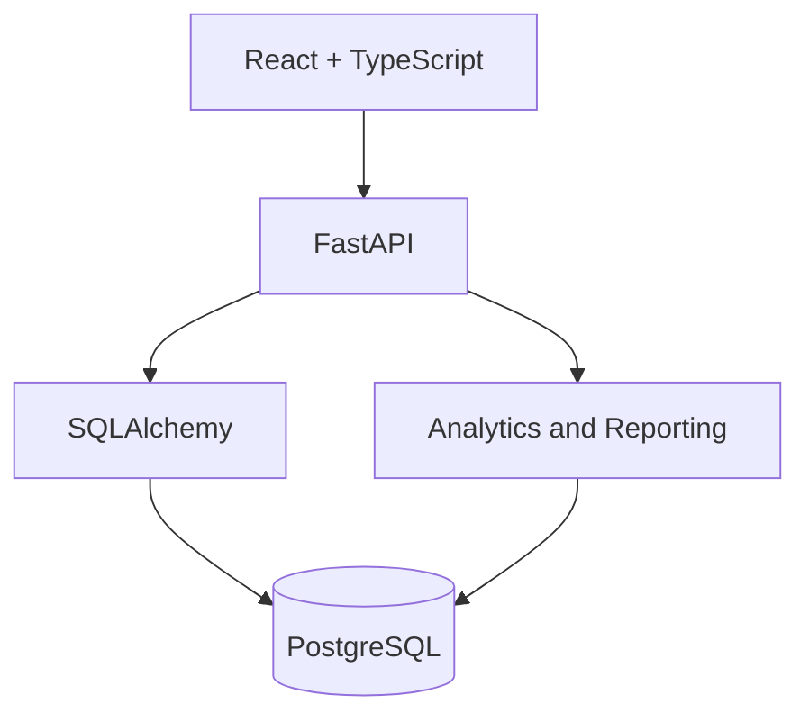
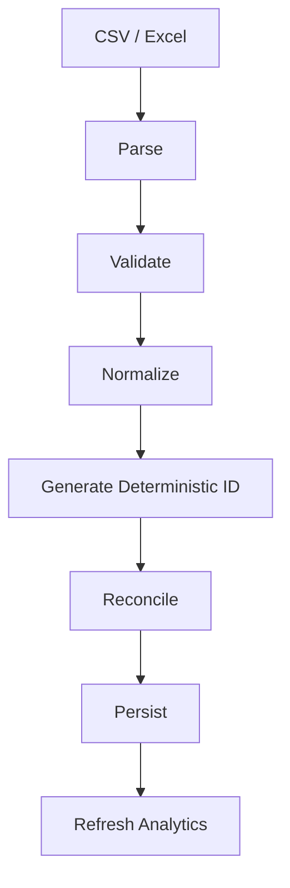

# MoneyBuddy Master Doc

## Overview

MoneyBuddy is a production-style financial data platform that ingests bank-statement data, normalizes it into a ledger, reconciles repeated imports idempotently, and exposes analytics through a full-stack web application.

## System Summary



## Core Engineering Story

1. Heterogeneous transaction data enters through CSV and Excel ingestion.
2. Source rows are validated and normalized into a consistent schema.
3. Deterministic transaction identifiers enable idempotent reconciliation.
4. A relational ledger becomes the source of truth for analytics and reporting.
5. Authenticated APIs expose data to a paginated, filterable frontend workspace.

## Key Technical Decisions

- Frontend: React, TypeScript, Vite, TanStack Query
- Backend: FastAPI, Pydantic, SQLAlchemy
- Persistence: PostgreSQL with Alembic migrations
- Auth: OAuth sign-in with JWT session tokens
- Quality: pytest, Vitest, ESLint, mypy, Ruff, GitHub Actions

## Ingestion Diagram



## Deployment Topology

```text
Vercel
  -> Vite frontend at /
  -> FastAPI API at /api and /health
  -> PostgreSQL
```

## Recommended Interview Focus

- End-to-end request flow from React to FastAPI to PostgreSQL
- Idempotency design and deterministic transaction IDs
- Reconciliation behavior for repeat imports
- Pagination, filtering, and query design
- Migration strategy and deployment workflow

## Maintainer

Created and maintained by **Samiksha Mitra**.
