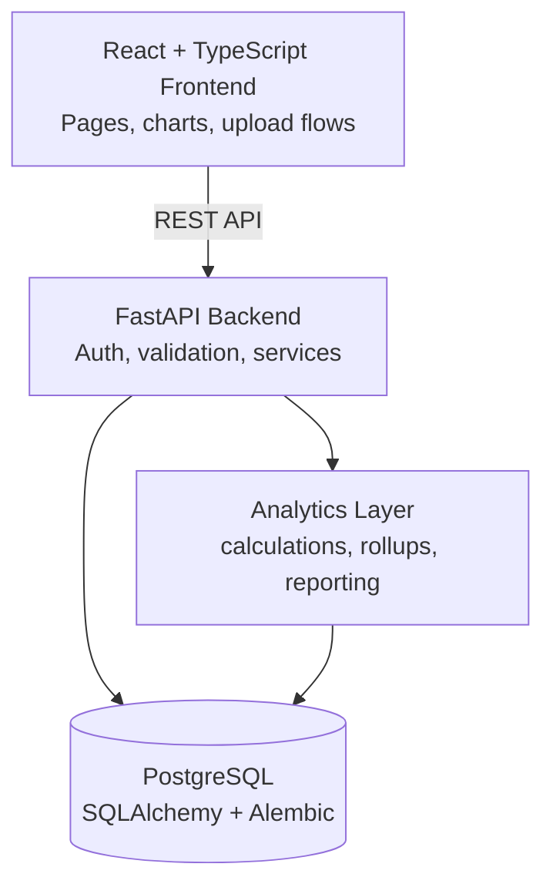
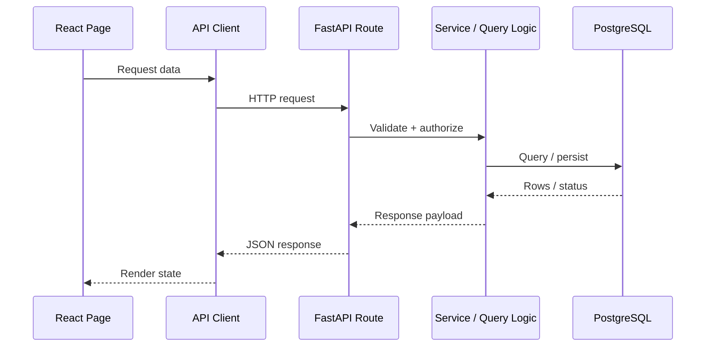
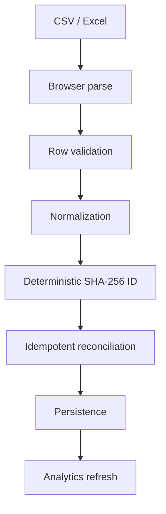

# Architecture

## System Overview



## Repository Layout

```text
MoneyBuddy/
  frontend/
  backend/
  docs/
  .github/workflows/
```

## Request Flow



## Ingestion Flow



## Backend Layers

- API layer: routing, auth, validation, error mapping
- Service layer: reconciliation, calculations, report logic
- Persistence layer: SQLAlchemy models and Alembic migrations
- Analytics layer: rollups, trends, anomaly detection, reporting helpers

## Frontend Layers

- Routed pages for dashboard, upload, transactions, analytics, planning, and settings
- Shared API client and TanStack Query cache
- Zustand stores for auth, preferences, and local UI state
- Reusable chart and table components
