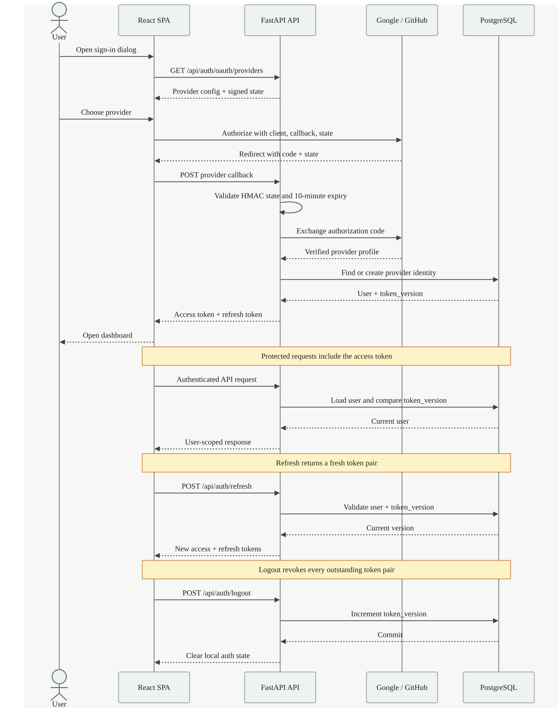

# System Architecture

Architecture reference for Ledger Sync 2.24.0.

Verified against the application entry points, route tree, stores, API
registration, model metadata, and deployment workflows on 2026-07-27.

## System Overview

<p align="center">
  
</p>

Ledger Sync is a static React workspace backed by a FastAPI JSON API and a
user-scoped relational ledger.

```text
Browser
  |
  +-- React 19 SPA on GitHub Pages
  |     +-- browser-side Excel and CSV parsing
  |     +-- TanStack Query server cache
  |     +-- Zustand client state
  |     +-- responsive desktop and phone workspace
  |
  +-- HTTPS JSON API
        +-- FastAPI on Vercel (ASGI)
              +-- SQLAlchemy and Alembic
              +-- Neon PostgreSQL 17
              +-- Google and GitHub OAuth
              +-- external rate and stock proxies
              +-- Bedrock chat proxy
```

Local development uses the same frontend and backend with SQLite and a Vite
proxy.

## Repository Layout

```text
ledger-sync/
  frontend/                   React and TypeScript SPA
  backend/                    Python and FastAPI service
  docs/                       Maintained references and dated records
  .github/workflows/          CI, deploy, migration, and keepalive workflows
  package.json                Root orchestration scripts
```

## Backend Architecture

<p align="center">
  
</p>

### API layer

Location: `backend/src/ledger_sync/api/`

Responsibilities:

- HTTP request and response contracts
- Authentication dependencies
- User-scoped query boundaries
- Rate limits
- External service proxies
- Error and status mapping

`main.py` creates the FastAPI app, shared `httpx` client, middleware, exception
handlers, health checks, and router registration.

The current OpenAPI schema contains 104 paths and 118 operations across:

- Authentication and OAuth
- Upload and transactions
- Tags, rules, and saved views
- Analytics and calculations
- Preferences and classifications
- Reports
- Currency, instrument, and stock rates
- AI chat, tools, and usage

See [API.md](API.md) for the complete inventory.

### Business logic

Location: `backend/src/ledger_sync/core/`

Key modules:

| Module | Responsibility |
| --- | --- |
| `sync_engine.py` | Coordinates row or CLI-file imports |
| `reconciler.py` | User-scoped upsert, restore, and soft-delete behavior |
| `reconciler_transfers.py` | Transfer-pair normalization and reconciliation |
| `calculator.py` | Pure on-demand financial metrics |
| `query_helpers.py` | Database-agnostic SQL and shared filters |
| `time_filter.py` | Relative ranges anchored on the IST ledger clock |
| `ledger_clock.py` | Single source of naive IST `now`, `today`, month, and financial-year boundaries |
| `expense_class.py` | Realised-capital-loss taxonomy that keeps trading losses out of consumption totals |
| `rules.py` | Categorization rule matching |
| `report_generator.py` | Monthly report construction |
| `encryption.py` | AES-256-GCM BYOK key encryption and legacy migration |
| `auth/` | JWT creation, decoding, and token-version verification |

Analytics implementation lives under `core/analytics/` as domain mixins:

```text
base.py
classification.py
summaries.py
trends.py
merchants.py
recurring.py
net_worth.py
fy_summaries.py
anomalies.py
cohort.py
engine.py
```

`merchant_extract.py` sits alongside them as a pure helper rather than a mixin.
It owns merchant label extraction: brands are matched with an ambiguity guard,
and a miss keeps the whole normalized note as a descriptor instead of the first
word, so nothing is dropped and unrelated purchases are not over-merged.

`core/analytics_engine.py` is a backwards-compatible facade that re-exports
the composed `AnalyticsEngine`. New analytics behavior belongs in the domain
package, not in the facade.

### Data access

Location: `backend/src/ledger_sync/db/`

- `base.py` owns the declarative base.
- `session.py` owns the engine and request-session lifecycle.
- `_models/` groups SQLAlchemy models by domain.
- `models.py` re-exports the public model surface.
- `migrations/versions/` contains the Alembic history.

The current metadata contains 26 tables. Production uses Neon PostgreSQL;
SQLite remains the local and test backend.

Every user-owned query includes `user_id`. Current model foreign keys use
database cascades for account deletion, but authorization remains an explicit
query concern.

### Schemas and services

Location:

```text
backend/src/ledger_sync/schemas/
backend/src/ledger_sync/services/
```

Pydantic models validate wire contracts. Services contain cross-router
workflows such as OAuth user creation, token refresh, account reset, and
account deletion.

### Ingestion

Location: `backend/src/ledger_sync/ingest/`

The web and CLI paths share normalization and hashing but enter differently:

- Web import parses files in the browser and calls `SyncEngine.import_rows`.
- CLI import reads a local file and calls `SyncEngine.import_file`.

The web upload router does not pass the source file through an Excel loader.

## Backend Request Lifecycle

For an authenticated financial request:

```text
request
  -> CORS and timing middleware
  -> security and cache headers
  -> IP and optional user rate limits
  -> JWT decode
  -> token_version comparison against users table
  -> CurrentUser dependency
  -> request-scoped SQLAlchemy session
  -> user-scoped router or domain logic
  -> commit only when the session has changes
  -> JSON response
```

An exception rolls back the request session. Database operational errors become
HTTP 503. Unexpected errors return a correlation ID without a traceback.

## Upload and Analytics Flow

<p align="center">
  
</p>

```text
Excel or CSV
  -> SheetJS browser parser
  -> flexible column mapping and validation
  -> SHA-256 raw-file hash
  -> authenticated JSON upload
  -> normalization
  -> occurrence-aware transaction IDs
  -> user-scoped reconciliation
  -> transaction commit
  -> full analytics refresh
  -> response statistics
  -> frontend query invalidation
```

The transaction hash includes user, date, amount, account, note, category,
subcategory, type, and a duplicate occurrence suffix when needed.

The reconciliation sweep is user-wide. Rows absent from the latest imported
snapshot are soft-deleted. Transfer source legs are paired into one canonical
row.

The API attempts an analytics refresh after every upload. If that refresh
fails, the transaction import remains successful and the user can run the
manual refresh endpoint.

## Frontend Architecture

Location: `frontend/src/`

```text
App.tsx
pages/
components/
hooks/
services/api/
store/
lib/
constants/
types/
```

### Routing and loading

`App.tsx` defines 29 routed page components:

- 3 public routes
- 26 protected workspace pages
- 4 eager page components
- 25 lazy page components

Eager components:

- Home
- Dashboard
- Demo Entry
- OAuth Callback

The remaining pages use `React.lazy`. Their chunks are prefetched during
browser idle time after authentication initialization. Suspense waits 150 ms
before showing the page spinner to avoid a flash for fast chunk loads.

The protected route wraps `AppLayout`, which renders the responsive shell and
an `<Outlet>`. `/home` is a compatibility redirect to `/dashboard`.

See [PAGES.md](PAGES.md) for every route and data source.

### Page layer

Simple pages can remain a single file. Larger pages use:

```text
pages/<feature>/
  <Feature>Page.tsx
  use<Feature>.ts
  types.ts
  <feature>Utils.ts
  components/
```

Page orchestrators own composition. Data shaping belongs in hooks and pure
utilities. Repeated visual patterns belong in shared components.

### Component layer

| Directory | Responsibility |
| --- | --- |
| `components/layout/` | Sidebar, mobile navigation, and workspace header |
| `components/ui/` | Buttons, cards, inputs, tables, chart containers, and page primitives |
| `components/shared/` | Cross-feature states, authentication UI, command palette, and preferences |
| `components/analytics/` | Reusable financial visualizations |
| `components/transactions/` | Ledger filters, table, tags, pagination, and saved views |
| `components/upload/` | Drop zone, account classification, and upload result UI |
| `components/chat/` | AI panel, messages, and orchestration |

`PageContainer` and `PageHeader` define page-level structure. Shared tokens in
`index.css` control theme, density, borders, chart colors, focus states, and
responsive behavior.

### Server state

TanStack Query owns data fetched from the API.

Defaults:

- Infinite stale time
- One retry
- No refetch on window focus
- One-hour garbage-collection time

Mutations invalidate affected query keys. Upload invalidates ledger and
analytics data after the backend response. Browser HTTP caching is disabled for
API data, so TanStack Query is the only client cache.

### API client

`services/api/client.ts` creates the shared Axios instance.

It:

- Uses `API_BASE_URL` from the constants layer
- Attaches the current access token
- Serializes concurrent refresh attempts through one mutex
- Replays queued requests after refresh
- Clears auth state when refresh fails
- Intercepts demo-mode reads
- Blocks demo-mode mutations

Feature service modules expose typed API methods. Hooks under `hooks/api/`
compose those services with TanStack Query.

### Client state

Zustand stores:

| Store | Responsibility |
| --- | --- |
| `authStore` | Token persistence and current auth state |
| `preferencesStore` | Normalized user preferences |
| `accountStore` | Account metadata |
| `investmentAccountStore` | Local investment-account set |
| `budgetStore` | Budget client state |
| `demoStore` | Demo mode activation |
| `themeStore` | Light or dark mode plus the resolved theme; new users start from the OS preference |

Stores should not duplicate API server state without a specific persistence or
cross-page reason.

### Demo mode

Demo entry seeds generated transactions and analytics into the query cache.
The API interceptor returns computed demo responses for supported GETs and
rejects mutations. The mode does not send the generated ledger to the backend.

### Responsive shell

Desktop uses a grouped sidebar and global workspace header. Phone layouts use
a fixed bottom bar plus the complete More page. Shared page and table
primitives switch wide tabular data into readable card or stacked layouts
where appropriate.

The layout reserves fixed space for navigation and safe areas so the chat
widget, demo banner, mobile bar, and page content do not overlap.

## Authentication Flow

<p align="center">
  
</p>

The backend, not the frontend, generates a signed OAuth state token. Callback
requests must return that state with the provider code. State is stateless,
HMAC-signed, and valid for 10 minutes, so it works across serverless instances.

JWTs contain the user ID, email, type, expiry, and token version. Protected
requests load the user and compare the token version. Logout and reset
increment the stored version and revoke every outstanding token pair.

The Axios refresh mutex prevents a burst of simultaneous 401 responses from
creating parallel refresh requests.

## AI Architecture

The assistant supports three provider adapters with one provider-neutral block
shape:

- OpenAI, browser-direct with the user's key
- Anthropic, browser-direct with the user's key
- Bedrock, backend proxy because AWS authentication and browser CORS require it

All adapters are non-streaming. One round returns complete JSON text or tool
requests. The tool loop:

```text
send messages
  -> receive text or tool_use blocks
  -> execute requested read-only tools in parallel
  -> append tool_result blocks
  -> send next round
  -> stop at end_turn or the configured round limit
```

`chatContext.ts` fetches preferences only. It provides currency, date,
fiscal-year context, and tool-use rules. Financial summaries are not copied
into the system prompt; the model calls one of 15 read-only, user-scoped tools
for data.

Browser-direct provider usage is logged through `/api/ai/usage/log`. Bedrock
usage is logged by the proxy to avoid double counting.

## Security Architecture

- OAuth-only login
- Signed, expiring OAuth state
- Verified provider email where required
- JWT access and refresh tokens with server-side version revocation
- Explicit user scoping in API and analytics queries
- Database `ON DELETE CASCADE` for current user foreign keys
- AES-256-GCM BYOK key encryption
- Dedicated HKDF-derived encryption key for current ciphertexts
- IP and authenticated-user rate limits
- Explicit CORS allowlist
- Security response headers and production HSTS
- No browser or service-worker cache for financial API responses
- No production source maps
- Bounded upload rows, AI rounds, and AI tool results
- Generic server errors with correlation IDs

## Performance Design

Backend:

- Shared `httpx` client for OAuth and stock calls
- PostgreSQL pool size 5 with max overflow 3 by default
- Pool pre-ping and bounded database timeouts
- User-scoped composite transaction indexes
- One active-transaction load per full analytics refresh
- Persisted daily, monthly, category, cohort, net-worth, and fiscal-year data
- GZip for larger responses

Frontend:

- Route-level lazy loading
- Idle chunk prefetch
- Vendor chunk splitting
- Infinite-stale server cache with explicit invalidation
- Lightweight facet and date-range endpoints instead of full-ledger reads
- Responsive chart sizing
- PWA app-shell caching with API denial rules

## Deployment

| Layer | Hosted platform |
| --- | --- |
| Frontend | GitHub Pages |
| Backend | Vercel serverless, ASGI |
| Database | Neon PostgreSQL 17 |

Frontend and backend deploy from `main`. A separate migration workflow runs
when migrations or model files change. See [DEPLOYMENT.md](DEPLOYMENT.md).

## Verification

CI has three gates:

- Frontend shared workflow for install, lint, build, and Vitest
- Backend Python 3.13 job for Ruff, format check, mypy, pytest, and an
  `alembic upgrade head` run against an empty database
- Shared security scan workflow

Current local suite baseline:

- 818 backend tests
- 1,401 frontend tests across 118 files
- 2,219 total tests

See [TESTING.md](TESTING.md) for commands and scope.

## Related Reading

- [API](API.md)
- [Database](DATABASE.md)
- [Calculations](CALCULATIONS.md)
- [Development](DEVELOPMENT.md)
- [Page Catalog](PAGES.md)
